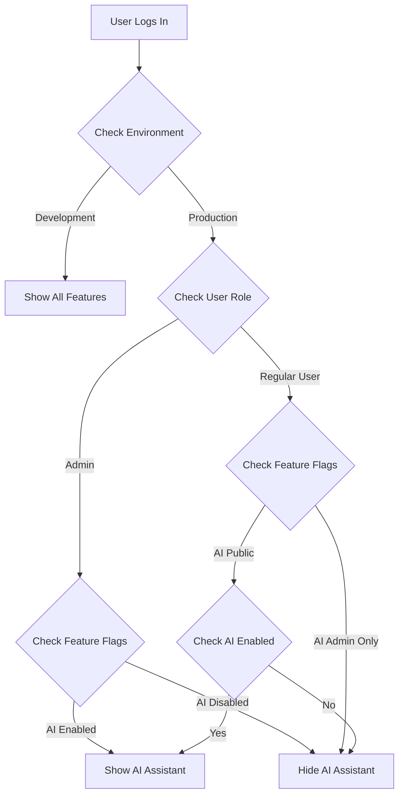

# 🎛️ Feature Flags Configuration Guide

This document explains how to configure feature visibility and access control in the Bloom Energy Contract System using environment-based feature flags.

## 🎯 Overview

The feature flag system allows you to control which features are visible to users based on:
- **Environment** (development vs production)
- **User role** (ADMIN, MANAGER, USER, VIEWER)  
- **User email** (for specific admin/developer access)
- **Environment variables** (for deployment-specific configuration)

## 🚀 Quick Configuration

### For Deployment Control (Hide AI Assistant in Production)

**Option 1: Environment Variables**
```bash
# Hide AI Assistant completely in production
export VITE_ENABLE_AI_ASSISTANT=false

# Or restrict AI Assistant to admins only
export VITE_AI_ASSISTANT_ADMIN_ONLY=true
```

**Option 2: Update Production Environment File**
```bash
# Edit .env.production
VITE_ENABLE_AI_ASSISTANT="false"
VITE_AI_ASSISTANT_ADMIN_ONLY="true"
```

**Option 3: Docker Environment**
```bash
# In your docker-compose.yml or deployment
environment:
  - VITE_ENABLE_AI_ASSISTANT=false
  - VITE_AI_ASSISTANT_ADMIN_ONLY=true
```

---

## 📋 Available Feature Flags

| Feature | Flag | Default (Dev) | Default (Prod) | Description |
|---------|------|---------------|----------------|-------------|
| AI Assistant | `VITE_ENABLE_AI_ASSISTANT` | `true` | `false` | Shows/hides AI Assistant tab |
| AI Admin Only | `VITE_AI_ASSISTANT_ADMIN_ONLY` | `false` | `true` | Restricts AI to admin users only |
| Analytics | `VITE_ENABLE_ANALYTICS` | `true` | `false` | Shows/hides Analytics dashboard |
| Rules Engine | `VITE_ENABLE_RULES_ENGINE` | `true` | `false` | Shows/hides Rules Engine |
| Document Upload | `VITE_ENABLE_DOCUMENT_UPLOAD` | `true` | `true` | Shows/hides Document Upload |
| Templates | `VITE_ENABLE_TEMPLATE_MANAGEMENT` | `true` | `false` | Shows/hides Template Management |
| Debug Mode | `VITE_ENABLE_DEBUG_MODE` | `true` | `false` | Enables debug indicators |

---

## 🎭 User-Based Access Control

### Admin Users
Admin users are defined in the feature flags configuration. Add emails to the admin list:

```typescript
// src/utils/featureFlags.ts
const ADMIN_EMAILS = [
  'your-email@company.com',
  'admin@bloomenergypartners.com',
  // Add more admin emails here
];
```

### Role-Based Access
Users are also checked by their database role:
- **ADMIN**: Full access to all features
- **MANAGER**: Limited access based on flags
- **USER**: Standard access
- **VIEWER**: Read-only access

---

## 🔧 Environment Configuration

### Development Environment
File: `.env.development`
```bash
VITE_NODE_ENV=development
VITE_ENABLE_AI_ASSISTANT=true
VITE_AI_ASSISTANT_ADMIN_ONLY=false
VITE_ENABLE_ANALYTICS=true
VITE_ENABLE_RULES_ENGINE=true
VITE_ENABLE_DOCUMENT_UPLOAD=true
VITE_ENABLE_TEMPLATE_MANAGEMENT=true
VITE_ENABLE_DEBUG_MODE=true
```

### Production Environment  
File: `.env.production`
```bash
VITE_NODE_ENV=production
VITE_ENABLE_AI_ASSISTANT=false
VITE_AI_ASSISTANT_ADMIN_ONLY=true
VITE_ENABLE_ANALYTICS=false
VITE_ENABLE_RULES_ENGINE=false
VITE_ENABLE_DOCUMENT_UPLOAD=true
VITE_ENABLE_TEMPLATE_MANAGEMENT=false
VITE_ENABLE_DEBUG_MODE=false
```

---

## 🐳 Docker Configuration

### Using Docker Compose
```yaml
services:
  app:
    environment:
      # Show AI Assistant only to admins in production
      VITE_ENABLE_AI_ASSISTANT: "true"
      VITE_AI_ASSISTANT_ADMIN_ONLY: "true"
      
      # Hide advanced features in production
      VITE_ENABLE_ANALYTICS: "false"
      VITE_ENABLE_RULES_ENGINE: "false"
      VITE_ENABLE_DEBUG_MODE: "false"
```

### Using Environment File
```bash
# Create .env.docker
VITE_ENABLE_AI_ASSISTANT=false
VITE_AI_ASSISTANT_ADMIN_ONLY=true

# Use with docker-compose
docker-compose --env-file .env.docker up
```

---

## ☁️ AWS/Production Deployment

### AWS ECS Task Definition
```json
{
  "environment": [
    {
      "name": "VITE_ENABLE_AI_ASSISTANT",
      "value": "false"
    },
    {
      "name": "VITE_AI_ASSISTANT_ADMIN_ONLY", 
      "value": "true"
    }
  ]
}
```

### AWS Systems Manager Parameter Store
```bash
# Store feature flags as parameters
aws ssm put-parameter \
    --name "/bloom-contracts/frontend/ai-assistant-enabled" \
    --value "false" \
    --type "String"
    
aws ssm put-parameter \
    --name "/bloom-contracts/frontend/ai-assistant-admin-only" \
    --value "true" \
    --type "String"
```

### CloudFormation Template
```yaml
Environment:
  - Name: VITE_ENABLE_AI_ASSISTANT
    Value: !Ref EnableAiAssistant
  - Name: VITE_AI_ASSISTANT_ADMIN_ONLY
    Value: !Ref AiAssistantAdminOnly
```

---

## 🎯 Common Use Cases

### 1. Hide AI Assistant in Production
```bash
# Method 1: Environment variable
export VITE_ENABLE_AI_ASSISTANT=false

# Method 2: In .env.production
echo "VITE_ENABLE_AI_ASSISTANT=false" >> .env.production

# Method 3: Docker override
docker run -e VITE_ENABLE_AI_ASSISTANT=false your-app
```

### 2. AI Assistant for Admins Only
```bash
# Allow AI Assistant but restrict to admins
export VITE_ENABLE_AI_ASSISTANT=true
export VITE_AI_ASSISTANT_ADMIN_ONLY=true
```

### 3. Enable AI for Specific User
```typescript
// Add user email to admin list in featureFlags.ts
const ADMIN_EMAILS = [
  'your-email@company.com',
  'new-admin@company.com',  // Add new admin
];
```

### 4. Staging Environment (Partial Features)
```bash
# Show some advanced features but not all
export VITE_ENABLE_AI_ASSISTANT=true
export VITE_AI_ASSISTANT_ADMIN_ONLY=true
export VITE_ENABLE_ANALYTICS=true
export VITE_ENABLE_RULES_ENGINE=false
export VITE_ENABLE_DEBUG_MODE=true
```

---

## 🔍 How It Works

### 1. Environment Detection
```typescript
const isDevelopment = () => {
  return NODE_ENV === 'development' || NODE_ENV === 'dev';
};
```

### 2. User Role Checking
```typescript
const isAdminUser = (user) => {
  return ADMIN_EMAILS.includes(user.email.toLowerCase());
};
```

### 3. Feature Flag Resolution
```typescript
const shouldShowAiAssistant = (user) => {
  // If explicitly disabled via environment variable
  if (ENABLE_AI_ASSISTANT === 'false') return false;
  
  // If admin-only mode is enabled
  if (AI_ASSISTANT_ADMIN_ONLY === 'true') {
    return isAdminUser(user);
  }
  
  // Default: show in development, hide in production unless admin
  return isDevelopment() || isAdminUser(user);
};
```

### 4. Navigation Filtering
```typescript
const navigationItems = allItems.filter(item => {
  if (item.requiresFeature) {
    return featureFlags[item.requiresFeature];
  }
  return true;
});
```

---

## 🚦 Access Control Flow



---

## 🛠️ Debugging Feature Flags

### Debug Mode Indicators
When `VITE_ENABLE_DEBUG_MODE=true`:
- Debug badges show in user profile
- Development mode indicators appear
- Console logging is enabled

### Check Current Flags
```typescript
// In browser console
console.log(window.__FEATURE_FLAGS__);

// Or check user profile badges in navigation
```

### Environment Variable Check
```bash
# Check current environment variables
printenv | grep VITE_

# In Node.js app
console.log(process.env.VITE_ENABLE_AI_ASSISTANT);
```

---

## 🔒 Security Considerations

### Frontend vs Backend
- Feature flags control **UI visibility** only
- Backend APIs should also validate permissions
- Don't rely solely on frontend flags for security

### Environment Variables
- Use `VITE_` prefix for frontend variables in Vite
- Avoid exposing sensitive data in frontend vars
- Use AWS Secrets Manager for sensitive configuration

### User Email Validation
- Admin emails are checked case-insensitively
- Emails are validated against authenticated user data
- Consider using role-based permissions from database

---

## 📚 Examples

### Complete Production Config
```bash
# .env.production - Secure production setup
VITE_NODE_ENV=production
VITE_ENABLE_AI_ASSISTANT=true
VITE_AI_ASSISTANT_ADMIN_ONLY=true
VITE_ENABLE_ANALYTICS=false
VITE_ENABLE_RULES_ENGINE=false
VITE_ENABLE_DOCUMENT_UPLOAD=true
VITE_ENABLE_TEMPLATE_MANAGEMENT=false
VITE_ENABLE_DEBUG_MODE=false
VITE_API_BASE_URL=/api
VITE_ENABLE_CONSOLE_LOGGING=false
```

### Development Override
```bash
# .env.local - Local development overrides
VITE_ENABLE_AI_ASSISTANT=true
VITE_AI_ASSISTANT_ADMIN_ONLY=false
VITE_ENABLE_DEBUG_MODE=true
```

### Deployment Script Integration
```bash
#!/bin/bash
# deployment script with feature flag control

if [ "$ENVIRONMENT" = "production" ]; then
    export VITE_ENABLE_AI_ASSISTANT=false
    export VITE_AI_ASSISTANT_ADMIN_ONLY=true
else
    export VITE_ENABLE_AI_ASSISTANT=true
    export VITE_AI_ASSISTANT_ADMIN_ONLY=false
fi

# Deploy with flags
docker build --build-arg VITE_ENABLE_AI_ASSISTANT=$VITE_ENABLE_AI_ASSISTANT .
```

---

## 🎉 That's It!

You now have complete control over feature visibility in your Bloom Energy Contract System. The AI Assistant (and other features) will be hidden in production unless specifically enabled for admin users.

For questions or issues, check the browser console for feature flag debugging information or contact your system administrator.