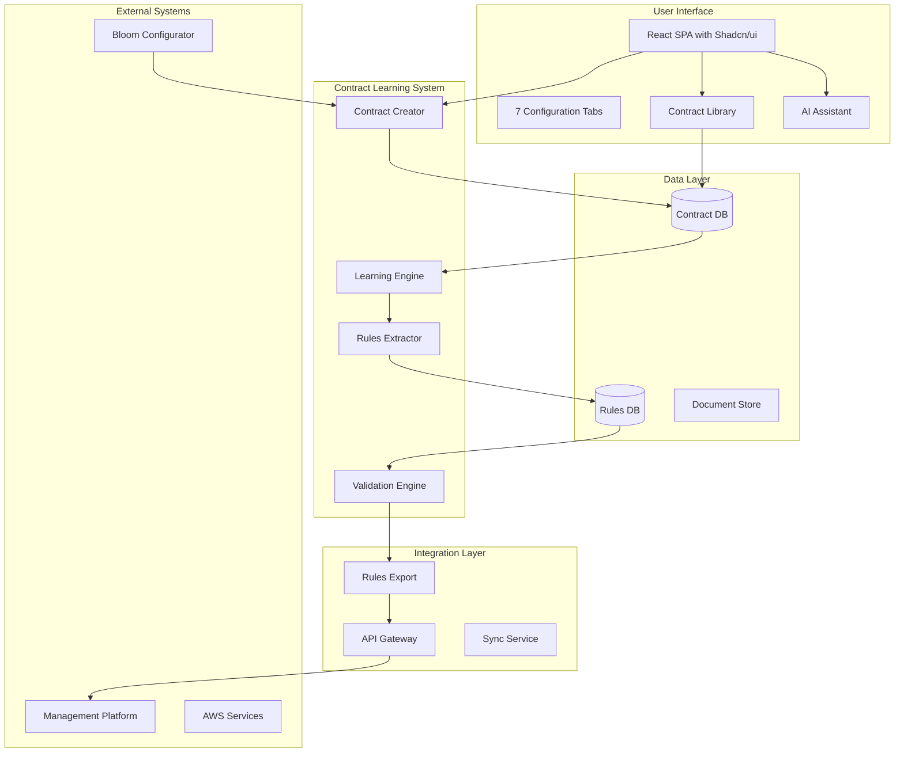
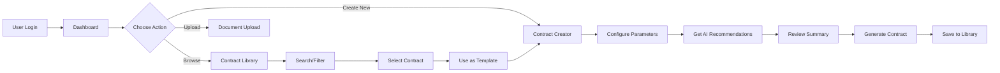

# Bloom Energy Contract Learning & Rules Management System - PRD

## Document Information
- **Version:** 2.0
- **Date:** January 2025
- **Status:** Draft
- **Owner:** Bloom Energy Digital Transformation Team
- **Integration Target:** Bloom Energy Management Platform

---

## Table of Contents
1. [Executive Summary](#1-executive-summary)
2. [Product Overview](#2-product-overview)
3. [Functional Requirements](#3-functional-requirements)
4. [Technical Specifications](#4-technical-specifications)
5. [AI Integration Strategy](#5-ai-integration-strategy)
6. [User Experience](#6-user-experience)
7. [Data Management](#7-data-management)
8. [Monitoring & Analytics](#8-monitoring--analytics)
9. [Testing Strategy](#9-testing-strategy)
10. [Implementation Roadmap](#10-implementation-roadmap)
11. [Budget & Resources](#11-budget--resources)
12. [Success Metrics & Acceptance Criteria](#12-success-metrics--acceptance-criteria)
13. [Risks & Mitigation](#13-risks--mitigation)
14. [Appendices](#14-appendices)
15. [Approval & Sign-off](#15-approval--sign-off)

---

## 1. Executive Summary

The Bloom Energy Contract Learning & Rules Management System is a comprehensive **AI-powered contract creation, management, and rules extraction platform** that serves dual purposes:

1. **Contract Operations:** Create, manage, and optimize energy service agreements
2. **Rules Intelligence:** Extract, learn, and export business rules to the centralized Management Platform

This system combines intelligent contract generation with continuous learning, creating a feedback loop that improves both contract creation and rule extraction over time.

### Key Objectives
- **Create** contracts in minutes using AI-powered recommendations
- **Manage** a searchable library of all contracts with version control
- **Learn** from historical contracts to improve future agreements
- **Extract** business rules for integration into the management platform
- **Optimize** pricing and terms based on portfolio intelligence
- **Export** validated rules via API to central systems

### Metrics at a Glance
| Metric | Current State | Target State |
|--------|--------------|--------------|
| Contract Creation Time | 2-3 days | < 30 minutes |
| Cost per Contract | $500 | $50 |
| Rule Extraction Accuracy | Manual/None | 95% automated |
| Portfolio Intelligence | None | Real-time |

---

## 2. Product Overview

### 2.1 Problem Statement

**Current Challenges:**
- Contract creation takes 2-3 days with manual processes
- No centralized repository of contract knowledge
- Business rules are scattered and inconsistent
- Unable to leverage historical data for optimization
- Disconnected from Bloom Configurator specifications
- No systematic way to extract rules for management platform

### 2.2 Solution

A unified platform providing:

**For Contract Operations:**
- Intelligent contract builder with dynamic forms
- AI assistant for optimization recommendations
- Searchable contract library
- Template management
- Real-time validation

**For Rules Management:**
- Automated rule extraction from contracts
- Pattern recognition and learning
- Rule validation and testing
- API-based export to management platform
- Continuous rule evolution tracking

### 2.3 System Architecture Overview



---

## 3. Functional Requirements

### 3.1 Contract Creation & Management Features

#### 3.1.1 Contract Creation Interface

**Seven Configuration Tabs:**

##### Tab 1: Create
- Start fresh or use template
- Recent contracts quick access
- Portfolio statistics display
- Quick start options

##### Tab 2: Basic Information
- Customer name and details
- Site address and location
- Contract dates (order, validity)
- Notes and tags
- Validation for required fields

##### Tab 3: System Configuration
- Rated capacity (325 kW increments)
- System type (PP, MG, AMG, OG)
- Guaranteed critical output
- Term length (5, 10, 15, 20 years)
- Payment terms
- Dynamic sliders with learned ranges

##### Tab 4: Financial Parameters
- Base rate and adders
- Escalation rates
- Budget allocations
- Real-time yearly rate calculations
- Total contract value display
- Monthly payment schedules

##### Tab 5: Operating Parameters
- Demand range configuration
- Warranty percentages
- Demand charge tiers
- Performance guarantees

##### Tab 6: Technical Specifications
- Voltage configurations
- Component selection (RI, AC, UC, BESS)
- Energy server count
- RECs configuration
- Installation type (PES, Ground, Stacked)

##### Tab 7: Summary
- Complete contract review
- Validation status
- Generate & download contract
- Export configuration

#### 3.1.2 Contract Library

**Features:**
- Search functionality across all fields
- Advanced filters (client, status, type, capacity, date)
- Contract cards with key metrics
- Quick actions (template, view, compare, delete)
- Bulk operations support
- Export capabilities

#### 3.1.3 AI Assistant Panel

**Capabilities:**
- Natural language queries
- Quick action buttons
- Real-time chat interface
- Auto-apply recommendations
- Context-aware responses
- Portfolio insights

#### 3.1.4 Document Upload & Processing

**Specifications:**
- Supported formats: PDF, Word, JSON
- Progress tracking with status updates
- Automatic parameter extraction
- Learning system updates
- Validation against existing rules

### 3.2 Rules Extraction & Management

#### 3.2.1 Rule Categories & Structure

```javascript
const RuleStructure = {
  financial: {
    baseRateRanges: { min: 55.00, max: 75.00 },
    escalationLimits: { standard: { min: 2.0, max: 4.0 }},
    paymentTerms: ['NET30', 'NET45', 'NET60', 'Prepaid'],
    budgetAllocations: { electrical: { min: 500000, max: 1000000 }}
  },
  technical: {
    capacityConstraints: { increment: 325, min: 325, max: 3900 },
    componentCompatibility: { required: ['ES5.8'] },
    voltageOptions: { handoff: ['208V', '480V', '600V', '4160V'] }
  },
  operational: {
    warrantyRequirements: { output: { min: 85, max: 99 }},
    demandManagement: { minRange: 0.2, maxRange: 0.8 },
    reliabilityTiers: ['3-9s', '4-9s', '5-9s']
  },
  compliance: {
    regulatoryByState: { 'CA': { recRequired: true, type: 'CA-RPS' }},
    contractTerms: { minTerm: 5, maxTerm: 20 }
  }
}
```

#### 3.2.2 Learning System Features

- **Pattern Recognition**
- **Anomaly Detection**
- **Trend Analysis**
- **Rule Validation**
- **Confidence Scoring**

---

## 4. Technical Specifications

### 4.1 Frontend Architecture

#### Technology Stack
- **Framework:** React 18+
- **UI Components:** Shadcn/ui
- **Styling:** Tailwind CSS
- **Icons:** Lucide React
- **State Management:** Zustand + localStorage
- **Forms:** React Hook Form + Zod
- **Charts:** Recharts
- **Build Tool:** Vite
- **Testing:** Jest + React Testing Library

#### Component Structure
```
src/
├── components/
│   ├── contract/
│   │   ├── ContractCreator.jsx
│   │   ├── ContractLibrary.jsx
│   │   ├── ContractSummary.jsx
│   │   └── tabs/
│   │       ├── BasicInfoTab.jsx
│   │       ├── SystemTab.jsx
│   │       ├── FinancialTab.jsx
│   │       ├── OperatingTab.jsx
│   │       └── TechnicalTab.jsx
│   ├── ai/
│   │   ├── AIAssistant.jsx
│   │   └── QuickActions.jsx
│   ├── shared/
│   │   ├── StatsBar.jsx
│   │   ├── Header.jsx
│   │   └── dialogs/
│   └── utils/
├── services/
├── hooks/
└── store/
```

### 4.2 Backend Architecture

#### Microservices
| Service | Technology | Purpose |
|---------|------------|---------|
| Contract Service | Node.js + Express | Contract CRUD operations |
| Learning Service | Python + FastAPI | ML/AI processing |
| Rules Service | Node.js + GraphQL | Rule management |
| AI Service | Node.js + Anthropic SDK | AI interactions |
| Integration Service | Node.js + REST | External integrations |

#### Database Schema (PostgreSQL)
```sql
-- Core Tables
CREATE TABLE contracts (
    id UUID PRIMARY KEY,
    client_id UUID REFERENCES clients(id),
    site_id UUID REFERENCES sites(id),
    configuration JSONB NOT NULL,
    status VARCHAR(20) NOT NULL,
    created_at TIMESTAMP DEFAULT NOW(),
    updated_at TIMESTAMP DEFAULT NOW()
);

CREATE TABLE rules (
    id UUID PRIMARY KEY,
    category VARCHAR(50) NOT NULL,
    type VARCHAR(50) NOT NULL,
    conditions JSONB,
    constraints JSONB,
    confidence FLOAT,
    source_contracts UUID[],
    version INTEGER NOT NULL,
    created_at TIMESTAMP DEFAULT NOW()
);

CREATE TABLE learning_history (
    id UUID PRIMARY KEY,
    contract_id UUID REFERENCES contracts(id),
    extracted_rules JSONB,
    confidence_scores JSONB,
    timestamp TIMESTAMP DEFAULT NOW()
);
```

### 4.3 AWS Infrastructure

#### Core Services
- **Compute:** ECS Fargate / Lambda
- **Storage:** S3 + RDS PostgreSQL
- **Cache:** ElastiCache (Redis)
- **API:** API Gateway
- **CDN:** CloudFront
- **Auth:** Cognito
- **Monitoring:** CloudWatch + DataDog

#### Infrastructure Configuration
```yaml
production:
  region: us-east-1
  availability_zones: 3
  
  compute:
    ecs_clusters: 2
    lambda_functions: 5
    
  storage:
    rds:
      instance: db.r5.xlarge
      multi_az: true
      backup_retention: 30
    s3:
      versioning: enabled
      encryption: AES-256
      
  networking:
    vpc_cidr: 10.0.0.0/16
    nat_gateways: 3
    
  security:
    waf: enabled
    guardduty: enabled
    secrets_manager: enabled
```

---

## 5. AI Integration Strategy

### 5.1 Multi-Tier AI Architecture

| Tier | Provider | Cost | Use Cases |
|------|----------|------|-----------|
| Basic | Claude Haiku | $0.25/1M tokens | Simple Q&A, validations |
| Advanced | Claude Sonnet | $3/1M tokens | Contract analysis, optimization |
| Premium | Claude Opus | $15/1M tokens | Complex learning, multi-contract analysis |

### 5.2 Document Processing Pipeline

```python
class DocumentProcessor:
    def process_contract(self, document):
        # 1. Text Extraction (AWS Textract)
        text = self.extract_text(document)
        
        # 2. Structure Recognition
        structure = self.parse_structure(text)
        
        # 3. Entity Extraction
        entities = self.extract_entities(structure)
        
        # 4. Parameter Identification
        parameters = self.identify_parameters(entities)
        
        # 5. Rule Generation
        rules = self.generate_rules(parameters)
        
        # 6. Validation
        validated = self.validate_rules(rules)
        
        # 7. Storage & Learning
        self.store_contract(validated)
        self.update_learning_model(validated)
        
        return validated
```

### 5.3 Cost Optimization Strategy

- **Caching:** 60% target hit rate
- **Batching:** Process up to 10 requests together
- **Tiering:** Route requests to appropriate AI tier
- **Fallback:** Anthropic → AWS Bedrock → Rule-based

---

## 6. User Experience

### 6.1 User Flows



### 6.2 Performance Requirements

| Metric | Target | Critical Threshold |
|--------|--------|-------------------|
| Page Load Time | < 2s | < 5s |
| Contract Generation | < 30s | < 60s |
| Document Processing | < 60s | < 120s |
| Search Results | < 500ms | < 2s |
| AI Response | < 2s | < 5s |
| Rule Extraction | < 30s | < 60s |
| System Uptime | 99.9% | 99.5% |

---

## 7. Data Management

### 7.1 Data Retention Policy

| Data Type | Active | Archived | Deleted |
|-----------|--------|----------|---------|
| Contracts | Indefinite | 7 years | 30 days (soft) |
| Rules | Indefinite | 5 years | 2 years |
| Logs | 90 days | 1 year | Permanent |
| Backups | 30 days | 12 months | After retention |

### 7.2 Data Privacy & Compliance

- **Encryption:** AES-256 at rest, TLS 1.3 in transit
- **Access Control:** RBAC with MFA
- **Audit Trail:** Complete logging of all actions
- **Compliance:** SOC2, ISO27001, GDPR, CCPA
- **Data Residency:** US-only AWS regions

---

## 8. Monitoring & Analytics

### 8.1 Key Performance Indicators (KPIs)

#### Business Metrics
| Metric | Current | Target (Year 1) |
|--------|---------|-----------------|
| Contracts Created/Month | 50 | 500 |
| Avg Creation Time | 3 days | 30 minutes |
| User Adoption Rate | N/A | 80% |
| Template Usage | N/A | 70% |
| Cost per Contract | $500 | $50 |

#### Technical Metrics
| Metric | Target | SLA |
|--------|--------|-----|
| API Response Time (p95) | 200ms | 1000ms |
| System Uptime | 99.9% | 99.5% |
| Rule Extraction Accuracy | 95% | 90% |
| AI Query Success Rate | 98% | 95% |

### 8.2 Monitoring Stack

```yaml
monitoring:
  application:
    tool: DataDog
    dashboards:
      - system_health
      - user_activity
      - business_metrics
      
  infrastructure:
    tool: CloudWatch
    alarms:
      - high_cpu
      - memory_pressure
      - api_errors
      - slow_queries
      
  logs:
    aggregation: CloudWatch Logs
    analysis: ElasticSearch
    retention: 90_days
    
  alerts:
    critical: PagerDuty
    warning: Slack
    info: Email
```

---

## 9. Testing Strategy

### 9.1 Testing Pyramid

| Level | Coverage | Tools | Frequency |
|-------|----------|-------|-----------|
| Unit Tests | 80% | Jest, React Testing Library | On commit |
| Integration Tests | 70% | Cypress, Postman | On PR |
| E2E Tests | Critical paths | Playwright | Daily |
| Performance Tests | Load scenarios | K6, Lighthouse | Weekly |
| Security Tests | OWASP Top 10 | OWASP ZAP, Snyk | Monthly |

### 9.2 Quality Gates

- [ ] All tests passing
- [ ] Code coverage > 80%
- [ ] No critical security vulnerabilities
- [ ] Performance benchmarks met
- [ ] Accessibility score > 90

---

## 10. Implementation Roadmap

### Phase 1: Foundation (Months 1-2) ✅ Partially Complete
- [x] 7-tab configuration interface
- [x] Basic validation
- [x] Local storage persistence
- [x] Contract generation (JSON export)
- [ ] PostgreSQL integration
- [ ] AWS deployment

### Phase 2: Intelligence Layer (Months 3-4)
- [x] AI Assistant interface
- [ ] Anthropic API integration (full)
- [x] Document upload UI
- [ ] AWS Textract integration
- [ ] Rule extraction engine
- [ ] Pattern recognition

### Phase 3: Library & Management (Months 5-6) ✅ Partially Complete
- [x] Contract library with search
- [x] Filtering and sorting
- [x] Template system
- [x] Comparison tool
- [ ] Version control
- [ ] Audit trail

### Phase 4: Integration (Months 7-8)
- [ ] Management platform API
- [ ] Rule export service
- [ ] Webhook system
- [ ] Real-time sync
- [ ] Configurator integration
- [ ] End-to-end testing

### Phase 5: Optimization (Months 9-10)
- [ ] Caching layer
- [ ] Query optimization
- [ ] Load balancing
- [ ] Multi-region support
- [ ] Advanced analytics
- [ ] A/B testing framework

---

## 11. Budget & Resources

### 11.1 Team Structure

| Role | Count | Monthly Cost |
|------|-------|--------------|
| Frontend Engineers | 2 | $30,000 |
| Backend Engineers | 2 | $30,000 |
| ML Engineer | 1 | $18,000 |
| DevOps Engineer | 1 | $18,000 |
| Product Manager | 1 | $16,000 |
| UX/UI Designer | 1 | $14,000 |
| QA Engineers | 2 | $24,000 |
| **Total** | **10** | **$150,000** |

### 11.2 Infrastructure & Services

| Category | Monthly | Annual |
|----------|---------|--------|
| AWS Infrastructure | $5,000 | $60,000 |
| AI APIs (Anthropic) | $3,000 | $36,000 |
| Third-party Services | $2,000 | $24,000 |
| Tools & Licenses | $1,000 | $12,000 |
| **Total** | **$11,000** | **$132,000** |

### 11.3 Total Project Cost

| Item | Year 1 |
|------|--------|
| Development Team | $1,800,000 |
| Infrastructure & Services | $132,000 |
| **Total Investment** | **$1,932,000** |

### 11.4 ROI Analysis

```
Current State:
- Contract creation: 3 days @ $500/contract
- Monthly volume: 50 contracts
- Monthly cost: $25,000
- Annual cost: $300,000

Future State:
- Contract creation: 30 minutes @ $50/contract
- Monthly volume: 500 contracts (10x)
- Monthly cost: $25,000
- Annual cost: $300,000 (same cost, 10x volume)

Value Creation:
- 10x throughput at same cost
- $450 savings per contract
- Error reduction: $50,000/year
- Time savings: 2.5 days per contract

ROI: 31% Year 1, 180% Year 2
Breakeven: Month 8
```

---

## 12. Success Metrics & Acceptance Criteria

### 12.1 Launch Criteria
- [ ] All 7 configuration tabs functional
- [ ] Contract generation < 60 seconds
- [ ] 95% accuracy in rule extraction
- [ ] AI response time < 5 seconds
- [ ] Process 100 test contracts successfully
- [ ] API integration with management platform
- [ ] 99.9% uptime in staging for 30 days

### 12.2 Success Metrics (6 months post-launch)
- [ ] 500+ contracts created
- [ ] 80% user adoption rate
- [ ] 90% reduction in contract creation time
- [ ] 95% customer satisfaction score
- [ ] 10,000+ rules extracted and validated
- [ ] Zero critical production incidents
- [ ] $200,000+ in demonstrated savings

---

## 13. Risks & Mitigation

| Risk | Impact | Probability | Mitigation Strategy |
|------|--------|-------------|---------------------|
| AI hallucinations | High | Medium | Multi-model validation, confidence thresholds, human review |
| Integration complexity | High | High | Phased rollout, extensive testing, fallback systems |
| User adoption | High | Medium | Training program, change management, incentives |
| Data quality issues | Medium | High | Validation rules, manual review queue, data cleaning |
| Scalability concerns | Medium | Low | Cloud-native architecture, auto-scaling, load testing |
| Security breach | Critical | Low | Encryption, access controls, monitoring, incident response |
| Vendor lock-in | Medium | Medium | Abstraction layers, portable architecture |
| Budget overrun | Medium | Low | Agile development, regular reviews, contingency fund |

---

## 14. Appendices

### Appendix A: Complete Feature List
- 7-tab contract configuration interface
- AI-powered recommendations
- Contract library with search and filters
- Document upload and processing
- Rule extraction and learning
- Template management
- Comparison tools
- Export capabilities
- API integrations
- Real-time validation

### Appendix B: Technical Documentation
- [API Specification](./docs/api-spec.md)
- [Database Schema](./docs/database-schema.md)
- [Integration Guide](./docs/integration-guide.md)
- [Security Protocols](./docs/security.md)

### Appendix C: User Documentation
- [User Manual](./docs/user-manual.md)
- [Admin Guide](./docs/admin-guide.md)
- [Training Materials](./docs/training.md)

### Appendix D: Compliance Documentation
- [SOC2 Compliance](./docs/soc2.md)
- [GDPR Compliance](./docs/gdpr.md)
- [Security Audit](./docs/security-audit.md)

---

## 15. Approval & Sign-off

| Role | Name | Signature | Date |
|------|------|-----------|------|
| Product Owner | | __________ | _____ |
| Engineering Lead | | __________ | _____ |
| Sales Director | | __________ | _____ |
| Operations Manager | | __________ | _____ |
| Finance Director | | __________ | _____ |
| Security Officer | | __________ | _____ |
| Legal Counsel | | __________ | _____ |
| CTO | | __________ | _____ |

---

## Document Control

**Version History:**
| Version | Date | Author | Changes |
|---------|------|--------|---------|
| 1.0 | Jan 2025 | Team | Initial draft |
| 2.0 | Jan 2025 | Team | Added complete application functionality |

**Distribution List:**
- Engineering Team
- Product Management
- Sales Leadership
- Operations
- Legal Department
- Executive Team

**Review Schedule:**
- Monthly during development
- Quarterly post-launch
- Annual comprehensive review

---

*This document is confidential and proprietary to Bloom Energy Corporation. Distribution is limited to authorized personnel only.*